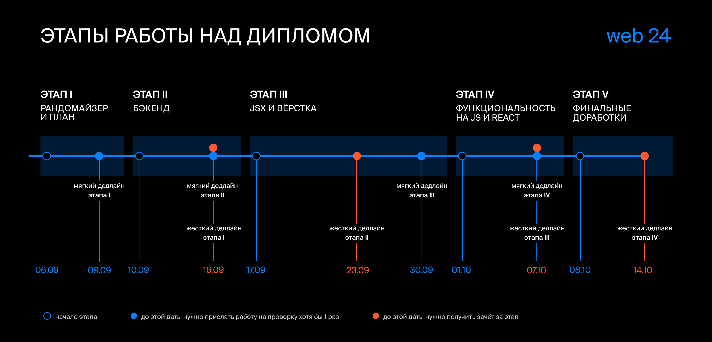
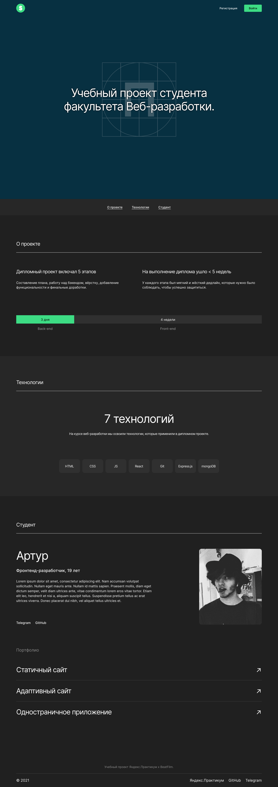

# movies-explorer-frontend

Фронтенд-часть приложения дипломного проекта `MoviesExplorer` со следующими возможностями: авторизации и регистрации пользователей, операции с фильмами и пользователями.

## Количество баллов: 100 [#1](https://github.com/artginzburg/movies-explorer-frontend/pull/1) [#4](https://github.com/artginzburg-learning/movies-explorer-frontend/pull/4)

### Ссылки

- [Чеклист 16](https://code.s3.yandex.net/web-developer/static/new-program/web-diploma-criteria-2.0/index.html)
- [Правила написания кода](https://code.s3.yandex.net/web-developer/landings/design-rules/index.html)
- Публичный IP: `62.84.116.184`
- Проект MoviesExplorer: https://deeplomka.nomoredomains.club
- [Макет в Figma](<./resources/Diploma%20(Copy).fig>)
- API проекта MoviesExplorer: https://api.deeplomka.nomoredomains.club

 
 

  <a href="https://github.com/artginzburg-learning/movies-explorer-api"><-- Prev.</a>
  &nbsp;
  <code><a href="https://github.com/artginzburg/yandex.praktikum-portfolio">Portfolio</a></code>
  &nbsp;
  <a>&nbsp;&nbsp;&nbsp;&nbsp;&nbsp;&nbsp;&nbsp;&nbsp;&nbsp;&nbsp;&nbsp;&nbsp;&nbsp;</a>

